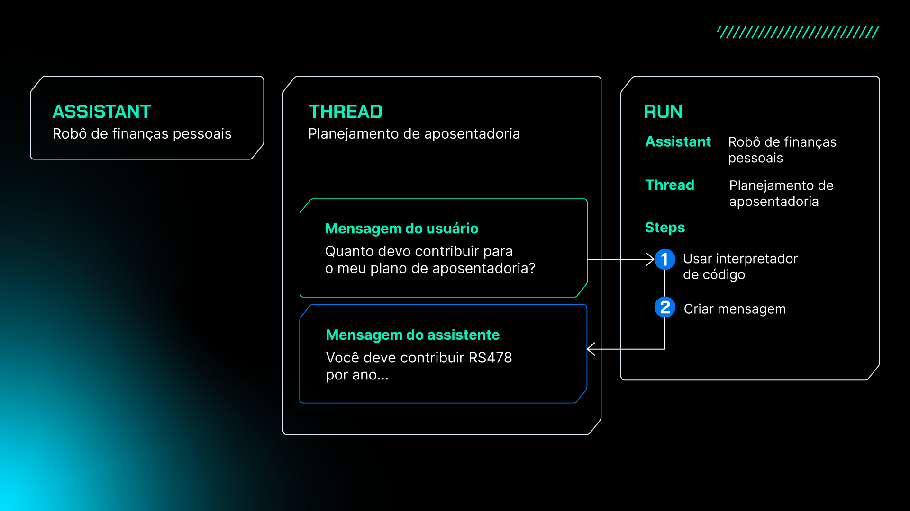
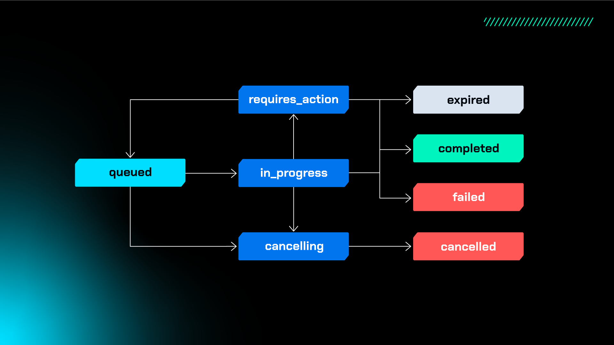

<div name="top-readme" align=center>
  <h1>Python e GPT</h1>
</div>

CURSO ALURA | Python e GPT: crie seu chatbot com IA

---

# 📌 Table of Contents

- [01. Integrando a API com o Front-End](#01-integrando-a-api-com-o-front-end)
  - [1. Tratamento da entrada](#1-tratamento-da-entrada)
  - [2. Exibição da mensagem que foi digitada na conversa](#2-exibição-da-mensagem-que-foi-digitada-na-conversa)
  - [3. Exibição da mensagem de resposta que vem da API](#3-exibição-da-mensagem-de-resposta-que-vem-da-api)
- [02. Refinando o Contexto de um Chatbot](#02-refinando-o-contexto-de-um-chatbot)
  - [Personas e Chatbots](#personas-e-chatbots)
    - [Por que personas são importantes para chatbots?](#por-que-personas-são-importantes-para-chatbots)
    - [Como a OpenAI facilita a criação de personas?](#como-a-openai-facilita-a-criação-de-personas)
    - [Experimentando personas](#experimentando-personas)
- [03. Gerenciando o Histórico do Chatbot com um Assistente](#03-gerenciando-o-histórico-do-chatbot-com-um-assistente)
  - [Apagando uma Thread](#apagando-uma-thread)

<p align="right"><a href="#top-readme">(back to top)</a></p>

---

# 01. Integrando a API com o Front-End

Apesar de este curso ter como foco a implementação do chatbot do ponto de vista de back-end, utilizando Python e Flask, disponibilizamos este material para você que quer entender melhor a **integração com o front-end**, principalmente no que diz respeito ao código JavaScript responsável pela exibição das respostas fornecidas pela API do chatbot.

Para começar, vamos considerar o arquivo `index.js` que se encontra no caminho `static/js` do projeto. Segue abaixo o código completo da função que vamos explorar:

```javascript
async function enviarMensagem() {
    if(input.value == "" || input.value == null) return;
    let mensagem = input.value;
    input.value = "";

    let novaBolha = criaBolhaUsuario();
    novaBolha.innerHTML = mensagem;
    chat.appendChild(novaBolha);

    let novaBolhaBot = criaBolhaBot();
    chat.appendChild(novaBolhaBot);
    vaiParaFinalDoChat();
    novaBolhaBot.innerHTML = "Analisando ..."
    
    // Envia requisição com a mensagem para a API do chatbot
    const resposta = await fetch("http://127.0.0.1:5000/chat", {
        method: "POST",
        headers: {
        "Content-Type": "application/json",
        },
        body: JSON.stringify({'msg':mensagem}),
    });
    const textoDaResposta = await resposta.text();
    console.log(textoDaResposta);
    novaBolhaBot.innerHTML = textoDaResposta.replace(/\n/g, '<br>');
    vaiParaFinalDoChat();
}
```

A função `enviarMensagem()` é disparada quando clicamos no botão de enviar do chat ou pressionamos a tecla `Enter`. Ela é responsável por atualizar o chat para mostrar o prompt que acabamos de enviar e depois a resposta recebida da API.

Para ilustrar melhor todo o processo, vamos considerar o estado inicial da página:


Agora vamos entender por partes o que acontece na função quando enviamos a mensagem.

## 1. Tratamento da entrada

No trecho abaixo verificamos se a mensagem enviada é vazia:

```javascript
    if(input.value == "" || input.value == null) return;
    let mensagem = input.value;
    input.value = "";
```

Se isso for verdade e a mensagem é vazia, simplesmente retornamos da função pois não há nada a fazer. Caso contrário, capturamos a mensagem que foi digitada no campo `input` do chat e guardamos na variável `mensagem`.

Se tiver curiosidade, você pode abrir o arquivo `templates/index.html` para verificar essa amarração entre o campo de entrada e o código JavaScript. Lá você vai encontrar a seguinte linha:

```javascript
<input type="text" class="entrada__input" placeholder="Enviar uma mensagem" id="input">
```

Esse é o código em HTML para a definição de um campo de entrada do tipo texto com o id `“input”`. Esse id é o nome que acessamos no código JavaScript para pegar o valor que foi digitado pela pessoa usuária do chat.

Por fim, apagamos o texto que foi digitado em preparação para que a pessoa usuária possa enviar novas mensagens.

Até esse ponto do código estamos com o seguinte estado para a tela:


## 2. Exibição da mensagem que foi digitada na conversa

Com o código abaixo estamos criando uma nova bolha no histórico da conversa para exibir a mensagem que acabamos de enviar:

```javascript
    let novaBolha = criaBolhaUsuario();
    novaBolha.innerHTML = mensagem;
    chat.appendChild(novaBolha);
```

A função `criaBolhaUsuario()` vai criar um novo elemento HTML que é armazenado temporariamente na variável `novaBolha`. A partir dessa variável conseguimos acessar uma propriedade chamada `innerHTML`. Essa propriedade permite a edição do conteúdo que vai dentro da bolha, isto é, a mensagem que queremos exibir dentro dela. Por fim, invocamos o método `appendChild` no `chat` para que esse novo elemento HTML seja inserido de fato na página e seja exibido logo abaixo do histórico de mensagens já existente.

Após esse trecho temos o seguinte estado para a tela do chat:


## 3. Exibição da mensagem de resposta que vem da API

O primeiro trecho de código que vamos considerar é o seguinte:

```javascript
    let novaBolhaBot = criaBolhaBot();
    chat.appendChild(novaBolhaBot);
    vaiParaFinalDoChat();
    novaBolhaBot.innerHTML = "Analisando ...";
```

Ele é bastante similar ao código para criar a bolha com a mensagem do usuário, mas agora estamos chamando uma função diferente para que a bolha seja criada do lado esquerdo, representando uma resposta do chatbot. Também fazemos uma chamada adicional para a função `vaiParaFinalDoChat()`, que é responsável por fazer a rolagem da tela para que a mensagem do chatbot fique visível na tela, principalmente quando for mais extensa. Por fim, garantindo que a nova bolha tenha em seu conteúdo o texto `"Analisando …"` até que a resposta do bot seja carregada.

Perceba que a bolha do chatbot está na interface, mas ainda precisamos preencher com o conteúdo recebido do chatbot. Para entender como isso é feito, vamos analisar o trecho seguinte código:

```javascript
// Envia requisição com a mensagem para a API do chatbot
   const resposta = await fetch("http://127.0.0.1:5000/chat", {
        method: "POST",
        headers: {
        "Content-Type": "application/json",
        },
        body: JSON.stringify({'msg':mensagem}),
    });
```

Neste trecho estamos fazendo a requisição para o endpoint `/chat` do nosso back-end em Flask. Especificamos que o método da requisição é um `POST` e indicamos no cabeçalho que o tipo de dado que estamos enviando é um JSON. Logo em seguida, descrevemos o corpo da requisição (`body`) e montamos um JSON com um único campo `msg`, cujo conteúdo é a variável `mensagem` que capturamos do usuário logo no início da função `enviarMensagem()`.

Por fim, acessamos a variável que representa a bolha do chat (`novaBolhaBot`) e de forma similar ao que fizemos com a bolha do usuário, acessamos a propriedade `innerHTML` para modificar o conteúdo da bolha com a `textoDaResposta` que temos.

Na imagem abaixo está um exemplo de estado da página enquanto a resposta está sendo construída:


Isso encerra o código de integração com o back-end. Podemos perceber que, de certa forma, o código lembra um pouco aquele que existe no back-end em Python.

<p align="right"><a href="#top-readme">(back to top)</a></p>

# 02. Refinando o Contexto de um Chatbot

## Personas e Chatbots

A integração de personas com chatbots nos permite construir sistemas interativos e personalizados para interagir com usuários reais. As personas ajudam a definir a voz, o estilo e a abordagem do chatbot, tornando-o mais engajante e eficaz na interação com os usuários. No contexto da OpenAI, a personalização do chatbot através de personas pode ser implementada utilizando as capacidades avançadas da API do GPT para criar experiências de conversação mais ricas e humanizadas.

### Por que personas são importantes para chatbots?

Personas bem definidas permitem que os chatbots se comuniquem de maneira mais natural e coerente com seu público-alvo. Isso não apenas melhora a experiência do usuário, mas também garante que o chatbot esteja alinhado com os objetivos e a marca da empresa.

### Como a OpenAI facilita a criação de personas?

A API do GPT da OpenAI oferece a flexibilidade necessária para integrar diferentes estilos de comunicação e personalidades em chatbots. Utilizando o [Playground da OpenAI](https://platform.openai.com/playground/chat?model=gpt-4&models=gpt-4o) ou a API diretamente, é possível definir instruções específicas para moldar a personalidade do chatbot, adequando-o ao contexto desejado.

### Experimentando personas

1. **Em "System" do Playground da OpenAI (ou via API) insira**:

`Você é um chatbot com a personalidade de um atendente experiente e amigável de uma loja de eletrônicos. Você fornece informações detalhadas sobre produtos e oferece suporte aos clientes com dúvidas.`

**Exemplo de persona**

```javascript
"personas": [
    {
      "name": "Atendente Eletrônicos",
      "description": "Um atendente experiente e amigável de uma loja de eletrônicos. Conhece profundamente os produtos e está sempre pronto para ajudar os clientes com informações e suporte."
    }
  ]
```

2. **Em "User" insira perguntas específicas relacionadas a produtos de eletrônicos**:

`Qual é o melhor smartphone para fotografia atualmente?`

3. **A OpenAI gerará respostas alinhadas com a persona definida**:

`O Samsung Galaxy S21 Ultra é uma ótima opção para fotografia, com seu sistema avançado de câmeras e recursos de alta qualidade.`

Para aprofundar seu conhecimento sobre a criação de personas para chatbots e como a OpenAI pode ser utilizada neste contexto, confira a [documentação da API da OpenAI](https://platform.openai.com/docs/overview) para entender como personalizar chatbots.

<p align="right"><a href="#top-readme">(back to top)</a></p>

# 03. Gerenciando o Histórico do Chatbot com um Assistente

## Apagando uma Thread

Trabalhar com a API da OpenAI envolve não apenas a criação de assistentes e threads, mas também o gerenciamento responsável desses recursos. Isso inclui a capacidade de apagar threads e assistentes por motivos de privacidade, segurança dos dados ou eficiência do sistema. Vamos explorar esse processo com um exemplo prático.

1. **Criação de um Assistente**

Primeiro, criamos um assistente chamado "Data Visualizer 3", que é capaz de criar visualizações de dados baseadas em um arquivo `.csv`.

```python
from openai import OpenAI
client = OpenAI(api_key="SUA_CHAVE_API")
file = client.files.create(
  file=open("data.csv", "rb"),
  purpose='assistants'
)
assistant = client.beta.assistants.create(
  name="Robô de finanças pessoais",
  description="Um assistente excelente em criar projeções financeiras",
  instructions="Você é um assistente amigável.",
  model="gpt-4-1106-preview",
  tools=[{"type": "code_interpreter"}],
  file_ids=[file.id]
)
```

Quando criamos um assistente é comum associarmos uma thread para manter o histórico de mensagens para este assistente. O fluxo de funcionamento inclui o processo de receber uma mensagem do usuário, processar esta informação em uma thread por meio de uma execução. Após concluída a execução o assistente devolve a resposta para ser consumida.



2. **Criação e gerenciamento de threads e mensagens**

Após a criação do assistente, criamos uma thread para a sessão de conversa entre o assistente e um usuário.

```python
thread = client.beta.threads.create(
  messages=[
    {
      "role": "user",
      "content": "Crie 3 visualizações de dados com base nas tendências deste arquivo.",
      "file_ids": [file.id]
    }
  ]
)
```

3. **Executando o assistente no thread (Run)**

Executamos o assistente no thread criado para processar a mensagem do usuário.

```python
run = client.beta.threads.runs.create(
  thread_id=thread.id,
  assistant_id=assistant.id
)
```

4. **Verificação do status da execução**

Incluímos um loop para verificar o status da execução até que seja completada.

```python
STATUS_COMPLETED = "completed"
while run.status != STATUS_COMPLETED:
    run = client.beta.threads.runs.retrieve(
        thread_id=thread.id,
        run_id=run.id
    )
    print(run.status)
```



Quando um assistente vai processar uma mensagem vinculada a uma thread, faz-se necessário criar uma execução (run). Esta execução permanece no status de "in_progress" até que a resposta seja entregue pelo assistente. No entanto, pode acontecer de esta solicitação expirar, falhar ou ser cancelada. Apenas quando esta execução alcança o status de completa existe a garantia de que a resposta foi elaborada pelo assistente. Ainda, quando utilizamos ferramentas (como Functions Calling, que serão exploradas na Aula 4), é necessário entregar uma resposta ao assistente, que permanece no status de "requires_action".

5. **Recuperando a resposta e apagando recursos**

Após a execução, recuperamos a resposta do assistente e procedemos com a exclusão do assistente e do thread.

```python
historico = list(client.beta.threads.messages.list(thread_id=thread.id).data)
resposta = historico[0]
print("Resposta: ", resposta)

client.beta.assistants.delete(assistant_id=assistant.id)
client.beta.threads.delete(thread_id=thread.id)
```
Este processo demonstra a utilização da API da OpenAI para criar e gerenciar assistentes e threads, e como apagá-los de forma responsável. Lembre-se de proteger a chave API e gerenciar os dados cuidadosamente, especialmente em ambientes de produção.

<p align="right"><a href="#top-readme">(back to top)</a></p>
<p align="right"><a href="#top-readme">(back to top)</a></p>
<p align="right"><a href="#top-readme">(back to top)</a></p>
<p align="right"><a href="#top-readme">(back to top)</a></p>
<p align="right"><a href="#top-readme">(back to top)</a></p>
