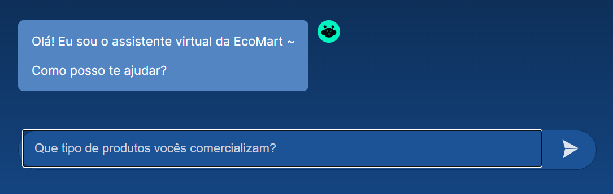
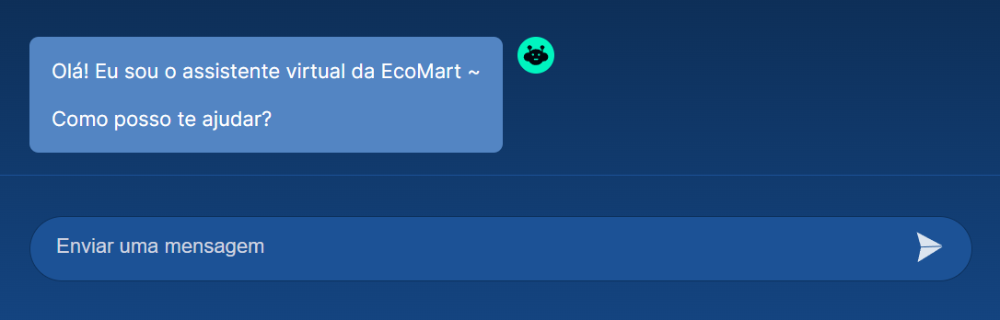
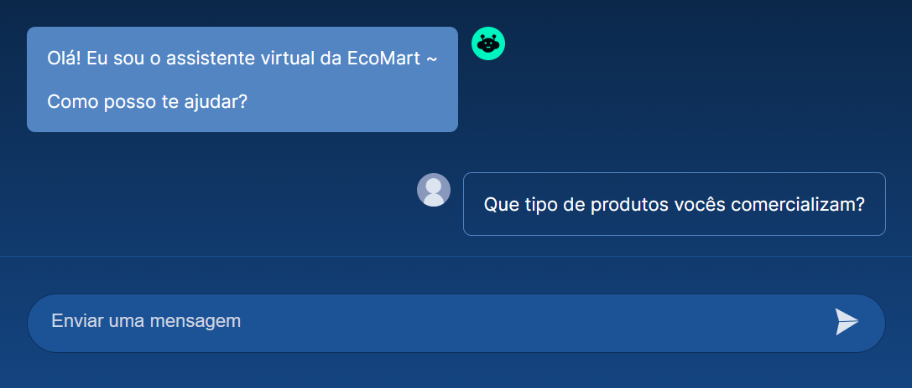
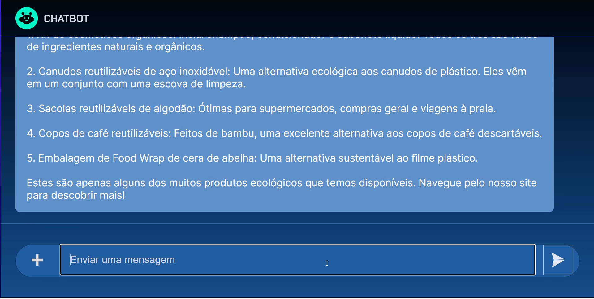

<div name="top-readme" align=center>
  <h1>Python e GPT</h1>
</div>

CURSO ALURA | Python e GPT: crie seu chatbot com IA

---

# 📌 Table of Contents

- [01. Integrando a API com o Front-End](#01-integrando-a-api-com-o-front-end)
  - [1. Tratamento da entrada](#1-tratamento-da-entrada)
  - [2. Exibição da mensagem que foi digitada na conversa](#2-exibição-da-mensagem-que-foi-digitada-na-conversa)
  - [3. Exibição da mensagem de resposta que vem da API](#3-exibição-da-mensagem-de-resposta-que-vem-da-api)

<p align="right"><a href="#top-readme">(back to top)</a></p>

---

# 01. Integrando a API com o Front-End

Apesar de este curso ter como foco a implementação do chatbot do ponto de vista de back-end, utilizando Python e Flask, disponibilizamos este material para você que quer entender melhor a **integração com o front-end**, principalmente no que diz respeito ao código JavaScript responsável pela exibição das respostas fornecidas pela API do chatbot.

Para começar, vamos considerar o arquivo `index.js` que se encontra no caminho `static/js` do projeto. Segue abaixo o código completo da função que vamos explorar:

```javascript
async function enviarMensagem() {
    if(input.value == "" || input.value == null) return;
    let mensagem = input.value;
    input.value = "";

    let novaBolha = criaBolhaUsuario();
    novaBolha.innerHTML = mensagem;
    chat.appendChild(novaBolha);

    let novaBolhaBot = criaBolhaBot();
    chat.appendChild(novaBolhaBot);
    vaiParaFinalDoChat();
    novaBolhaBot.innerHTML = "Analisando ..."
    
    // Envia requisição com a mensagem para a API do chatbot
    const resposta = await fetch("http://127.0.0.1:5000/chat", {
        method: "POST",
        headers: {
        "Content-Type": "application/json",
        },
        body: JSON.stringify({'msg':mensagem}),
    });
    const textoDaResposta = await resposta.text();
    console.log(textoDaResposta);
    novaBolhaBot.innerHTML = textoDaResposta.replace(/\n/g, '<br>');
    vaiParaFinalDoChat();
}
```

A função `enviarMensagem()` é disparada quando clicamos no botão de enviar do chat ou pressionamos a tecla `Enter`. Ela é responsável por atualizar o chat para mostrar o prompt que acabamos de enviar e depois a resposta recebida da API.

Para ilustrar melhor todo o processo, vamos considerar o estado inicial da página:



Agora vamos entender por partes o que acontece na função quando enviamos a mensagem.

## 1. Tratamento da entrada

No trecho abaixo verificamos se a mensagem enviada é vazia:

```javascript
    if(input.value == "" || input.value == null) return;
    let mensagem = input.value;
    input.value = "";
```

Se isso for verdade e a mensagem é vazia, simplesmente retornamos da função pois não há nada a fazer. Caso contrário, capturamos a mensagem que foi digitada no campo `input` do chat e guardamos na variável `mensagem`.

Se tiver curiosidade, você pode abrir o arquivo `templates/index.html` para verificar essa amarração entre o campo de entrada e o código JavaScript. Lá você vai encontrar a seguinte linha:

```javascript
<input type="text" class="entrada__input" placeholder="Enviar uma mensagem" id="input">
```

Esse é o código em HTML para a definição de um campo de entrada do tipo texto com o id `“input”`. Esse id é o nome que acessamos no código JavaScript para pegar o valor que foi digitado pela pessoa usuária do chat.

Por fim, apagamos o texto que foi digitado em preparação para que a pessoa usuária possa enviar novas mensagens.

Até esse ponto do código estamos com o seguinte estado para a tela:



## 2. Exibição da mensagem que foi digitada na conversa

Com o código abaixo estamos criando uma nova bolha no histórico da conversa para exibir a mensagem que acabamos de enviar:

```javascript
    let novaBolha = criaBolhaUsuario();
    novaBolha.innerHTML = mensagem;
    chat.appendChild(novaBolha);
```

A função `criaBolhaUsuario()` vai criar um novo elemento HTML que é armazenado temporariamente na variável `novaBolha`. A partir dessa variável conseguimos acessar uma propriedade chamada `innerHTML`. Essa propriedade permite a edição do conteúdo que vai dentro da bolha, isto é, a mensagem que queremos exibir dentro dela. Por fim, invocamos o método `appendChild` no `chat` para que esse novo elemento HTML seja inserido de fato na página e seja exibido logo abaixo do histórico de mensagens já existente.

Após esse trecho temos o seguinte estado para a tela do chat:



## 3. Exibição da mensagem de resposta que vem da API

O primeiro trecho de código que vamos considerar é o seguinte:

```javascript
    let novaBolhaBot = criaBolhaBot();
    chat.appendChild(novaBolhaBot);
    vaiParaFinalDoChat();
    novaBolhaBot.innerHTML = "Analisando ...";
```

Ele é bastante similar ao código para criar a bolha com a mensagem do usuário, mas agora estamos chamando uma função diferente para que a bolha seja criada do lado esquerdo, representando uma resposta do chatbot. Também fazemos uma chamada adicional para a função `vaiParaFinalDoChat()`, que é responsável por fazer a rolagem da tela para que a mensagem do chatbot fique visível na tela, principalmente quando for mais extensa. Por fim, garantindo que a nova bolha tenha em seu conteúdo o texto `"Analisando …"` até que a resposta do bot seja carregada.

Perceba que a bolha do chatbot está na interface, mas ainda precisamos preencher com o conteúdo recebido do chatbot. Para entender como isso é feito, vamos analisar o trecho seguinte código:

```javascript
// Envia requisição com a mensagem para a API do chatbot
   const resposta = await fetch("http://127.0.0.1:5000/chat", {
        method: "POST",
        headers: {
        "Content-Type": "application/json",
        },
        body: JSON.stringify({'msg':mensagem}),
    });
```

Neste trecho estamos fazendo a requisição para o endpoint `/chat` do nosso back-end em Flask. Especificamos que o método da requisição é um `POST` e indicamos no cabeçalho que o tipo de dado que estamos enviando é um JSON. Logo em seguida, descrevemos o corpo da requisição (`body`) e montamos um JSON com um único campo `msg`, cujo conteúdo é a variável `mensagem` que capturamos do usuário logo no início da função `enviarMensagem()`.

Por fim, acessamos a variável que representa a bolha do chat (`novaBolhaBot`) e de forma similar ao que fizemos com a bolha do usuário, acessamos a propriedade `innerHTML` para modificar o conteúdo da bolha com a `textoDaResposta` que temos.

Na imagem abaixo está um exemplo de estado da página enquanto a resposta está sendo construída:



Isso encerra o código de integração com o back-end. Podemos perceber que, de certa forma, o código lembra um pouco aquele que existe no back-end em Python.

<p align="right"><a href="#top-readme">(back to top)</a></p>
<p align="right"><a href="#top-readme">(back to top)</a></p>
<p align="right"><a href="#top-readme">(back to top)</a></p>
<p align="right"><a href="#top-readme">(back to top)</a></p>
<p align="right"><a href="#top-readme">(back to top)</a></p>
<p align="right"><a href="#top-readme">(back to top)</a></p>
<p align="right"><a href="#top-readme">(back to top)</a></p>
